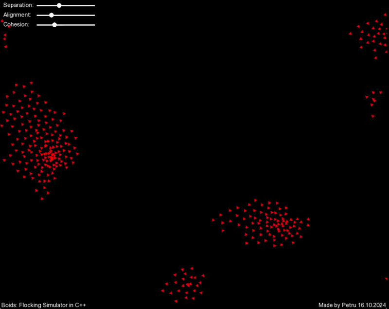

# Boids
A Boids flocking simulator made in C++ using SFML: How three simple rules govern flocking behaviour in nature.




## Movement

For boid $i$:

- $p_i$ is its position
- $v_i$ is its velocity
- $N_i$ is the set of nearby boids

### 1) Separation

Separation keeps boids from getting too close to each other.

Each boid moves away from nearby boids:

$$
F_{sep}(i) = \sum_{j \in N_i} \frac{p_i - p_j}{\|p_i - p_j\|}
$$

### 2) Alignment

Alignment makes a boid point in the same direction as its neighbours.

Each boid tries to match the average velocity nearby:

$$
F_{align}(i) = \frac{1}{|N_i|}\sum_{j \in N_i} v_j - v_i
$$


### 3) Cohesion

Cohesion pulls boids toward the center of nearby boids.

Each boid moves toward the average position nearby:

$$
F_{coh}(i) = \frac{1}{|N_i|}\sum_{j \in N_i} p_j - p_i
$$


### Final Force Calculation
The final force is a mix of all three:

$$
F(i) = w_sF_{sep}(i) + w_aF_{align}(i) + w_cF_{coh}(i)
$$

> The $w_s$, $w_a$ and $w_c$ are tunable sliders in the GUI - this way we can experiment with how much separation, alignment or cohesion influence behaviour.

## Physics Engine

I built a small custom physics engine using 2D vectors.

Each boid has position, velocity and acceleration:

$$
v = limit(v + a), \quad p = p + v
$$

The flocking forces are added to acceleration, then speed and steering are limited so the movement stays smooth.

## Emergent Behaviour

There is no leader controlling the flock.

Each boid only follows simple local rules, but together they create natural flocking movement.

## Build & Running instructions

```sh
cmake --preset fast
cmake --build --preset fast
```

For a debug build, use:

```sh
cmake --preset debug
cmake --build --preset debug
```

The debug preset enables sanitizers when the local compiler and linker support them.

Run the app with:

```sh
cmake --build --preset fast --target run
```


## Resources

- [Wikipedia Article on Boids](https://en.wikipedia.org/wiki/Boids)

- [Stanford Article on Boids](https://cs.stanford.edu/people/eroberts/courses/soco/projects/2008-09/modeling-natural-systems/boids.html)
